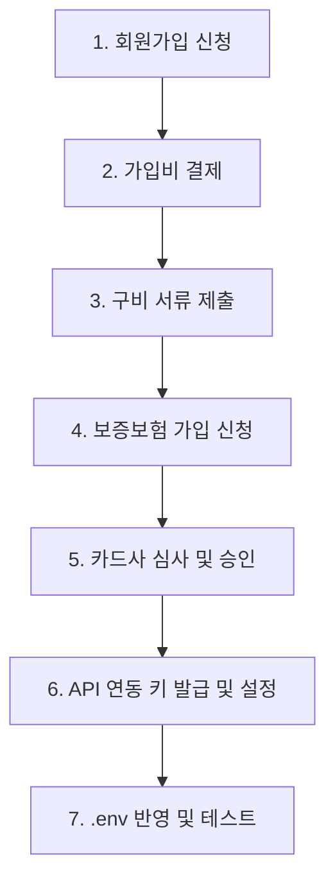

# 💳 페이앱(PayApp) 가입 및 API 연동 등록 절차 가이드

본 문서는 **Situation Room / MQnet** 시스템에서 비대면 원격 결제, 분할 결제(더치페이), 현금영수증 발행 기능을 정상적으로 사용하기 위한 **페이앱(PayApp) 서비스 가입 및 API 연동 절차**를 정리한 가이드입니다.

---

## 📌 1. 가입 및 승인 프로세스 요약



---

## 📂 2. 단계별 세부 절차

### 1단계: 페이앱 회원가입
1. **페이앱 공식 홈페이지 접속**: [https://www.payapp.kr](https://www.payapp.kr)
2. **회원가입 유형 선택**:
   * **개인 판매자 (비사업자)**: 사업자등록증이 없는 개인 셀러 (단, 연 한도 및 결제 금액 제한이 적용될 수 있음)
   * **개인 사업자**: 사업자등록증을 소지한 개인 기업
   * **법인 사업자**: 법인 명의의 기업
3. **기본 정보 입력**: 아이디(USERID), 비밀번호, 휴대전화 번호, 정산용 은행 계좌 정보 등 입력

### 2단계: 가입비 결제
* 페이앱은 서비스 이용을 위해 최초 1회 가입비가 발생합니다. (통상 220,000원 VAT 포함 / 제휴 혜택에 따라 감면될 수 있음)
* 결제가 완료되면 관리자 시스템 로그인 권한 및 가입 대기 상태로 전환됩니다.

### 3단계: 계약서 작성 및 증빙 서류 제출
가입 구분에 따른 구비 서류를 준비하여 페이앱 판매자 관리자 화면에서 업로드하거나 이메일/팩스로 제출합니다.

| 구분 | 제출 서류 목록 |
| :--- | :--- |
| **비사업자 (개인)** | 1. 대표자 신분증 사본<br>2. 대표자 명의 정산 통장 사본 |
| **개인 사업자** | 1. 사업자등록증 사본<br>2. 대표자 신분증 사본<br>3. 대표자 명의 정산 통장 사본 |
| **법인 사업자** | 1. 사업자등록증 사본<br>2. 법인 등기부등본 사본 (3개월 이내 발급)<br>3. 법인 인감증명서 사본 (3개월 이내 발급)<br>4. 법인 명의 정산 통장 사본<br>5. 대표자 신분증 사본 (대리인 시 위임장 추가) |

### 4단계: 보증보험 가입 (필요 시)
* 배송 전 결제, 취소, 환불 사고에 대비하여 SGI서울보증 등을 통해 보증보험을 가입합니다.
* 개인(비사업자)이나 특정 위험 업종인 경우, 보증보험 가입 완료 후에만 카드사 심사가 개시됩니다. (가입 한도 금액은 월 매출 예상 한도에 비례해 설정)

### 5단계: 카드사 심사 (약 3~7영업일 소요)
* 서류 및 보증보험 검토가 끝나면 8대 카드사(국민, 신한, 삼성, 현대, 비씨, 롯데, 농협, 하나)의 개별 가맹 심사가 순차 진행됩니다.
* 승인이 완료되면 실결제 서비스가 완전히 활성화됩니다.

---

## 🔑 3. API 연동 정보 발급 및 설정

심사 완료 후, 우리 시스템(백엔드 서버)과 통신하기 위한 API 키값을 발급받고 설정해야 합니다.

### 1) 페이앱 관리자 로그인 및 키 확인
1. **페이앱 판매자 관리자 시스템**([로그인 페이지](https://www.payapp.kr/query/login.html))에 접속합니다.
2. **[설정/관리] ➔ [연동관리]** 또는 **[API 연동설정]** 메뉴로 이동합니다.
3. 아래의 **3가지 핵심 연동 값**을 메모합니다.
   * **USERID**: 페이앱 가입 아이디
   * **LINKKEY (연동 Key)**: API 호출 및 승인 검증용 대칭 키
   * **LINKVAL (검증 Key)**: 결제 완료 후 결제 데이터 위변조 확인 및 피드백(Webhook) 서명용 키

### 2) 피드백 URL (Feedback URL / Webhook) 설정
페이앱을 통해 결제창이 띄워지고 고객이 결제를 완료했을 때, 우리 서버의 데이터베이스를 실시간으로 결제 완료(`paid`) 상태로 업데이트하고 주방 알림을 발생시키기 위해 웹훅 설정이 필요합니다.

* **피드백 URL 등록**:
  * 관리자 연동 설정 내 **피드백 URL(Feedback URL)**에 아래 주소를 기본값으로 설정해 줍니다.
  * `https://[도메인]/api/payment/payapp/feedback` (예: `https://chicvill.store/api/payment/payapp/feedback`)
  * *참고: 본 시스템에서는 프론트엔드 결제 요청 시 파라미터(`feedbackurl`)로 이 값을 동적으로 함께 전달하고 있습니다.*

### 3) 현금영수증 자동 발행 API 활성화
* 현금성 결제(계좌이체 등) 고객에 대해 국세청 현금영수증을 자동으로 발급하기 위해, 페이앱 연동 관리 메뉴 내 **현금영수증 API 사용 권한**이 활성화(신청)되어 있는지 확인하십시오.

---

## ⚙️ 4. 시스템 반영 방법 (.env)

메모한 API 키값을 운영 백엔드 서버의 환경 변수 설정 파일(`.env`)에 기입합니다.

```env
# ----------------------------------------------------
# PayApp Configuration (B2B Terminal-Free Payments)
# ----------------------------------------------------
PAYAPP_USERID=himin53               # 가입한 페이앱 ID
PAYAPP_LINKKEY=qJ42gWTeu8HQzBR1...  # 발급받은 LINKKEY (연동키)
PAYAPP_LINKVAL=qJ42gWTeu8HQzBR...  # 발급받은 LINKVAL (검증키)
```

> [!NOTE]
> * 로컬 개발 컴퓨터 및 개발서버에서는 `PAYAPP_USERID`를 `payapp_test_id`로 지정하면 실제 카드사 결제 호출을 우회(Bypass)하여 모의 결제 성공 테스트가 가능합니다.
> * 이 경우 `PAYAPP_LINKKEY`와 `PAYAPP_LINKVAL`은 임의의 테스트값(기본값)으로 지정되어도 무관합니다.

---

## 🧪 5. 연동 동작 검증 (테스트 방법)

환경 변수 설정이 완료되었다면 아래의 테스트 도구를 실행하여 시스템이 정상적으로 결제/취소/웹훅을 처리하는지 검증합니다.

### 1) 통합 테스트 실행 (Mocking & Local E2E)
로컬 터미널에서 아래 테스트 스크립트들을 기동하여 백엔드가 페이앱 API 및 피드백 데이터를 문제없이 받아 처리하는지 검증할 수 있습니다.

* **결제 E2E 테스트 스크립트 실행**
  ```powershell
  python c:\Users\USER\Desktop\Workstation\situation\scratch\test_payapp.py
  ```
  *(결과로 `ALL TESTS PASSED! PayApp Integration works perfectly!`가 출력되는지 확인합니다.)*

* **현금영수증 API 연동 테스트 실행**
  ```powershell
  python c:\Users\USER\Desktop\Workstation\situation\scratch\test_cash_receipt.py
  ```

### 2) 운영 환경 실결제 검증
1. 운영 사이트([chicvill.store](https://chicvill.store))에 직접 접속합니다.
2. 테이블 또는 카운터에서 소액(예: 1,000원) 메뉴를 주문하고 결제 방식으로 '페이앱'을 선택합니다.
3. 실제 카드로 결제를 완료한 후, 카운터 상황판 및 주방 알림에 `NEW_ORDER` 및 `PAYMENT_CONFIRMED` 알림이 즉시 수신되는지 확인합니다.
4. 관리자 페이지에서 주문 취소(환불)를 진행하여 실제 승인이 취소되고 데이터베이스에 `refunded`/`cancelled`로 변경되는지 검증합니다.
