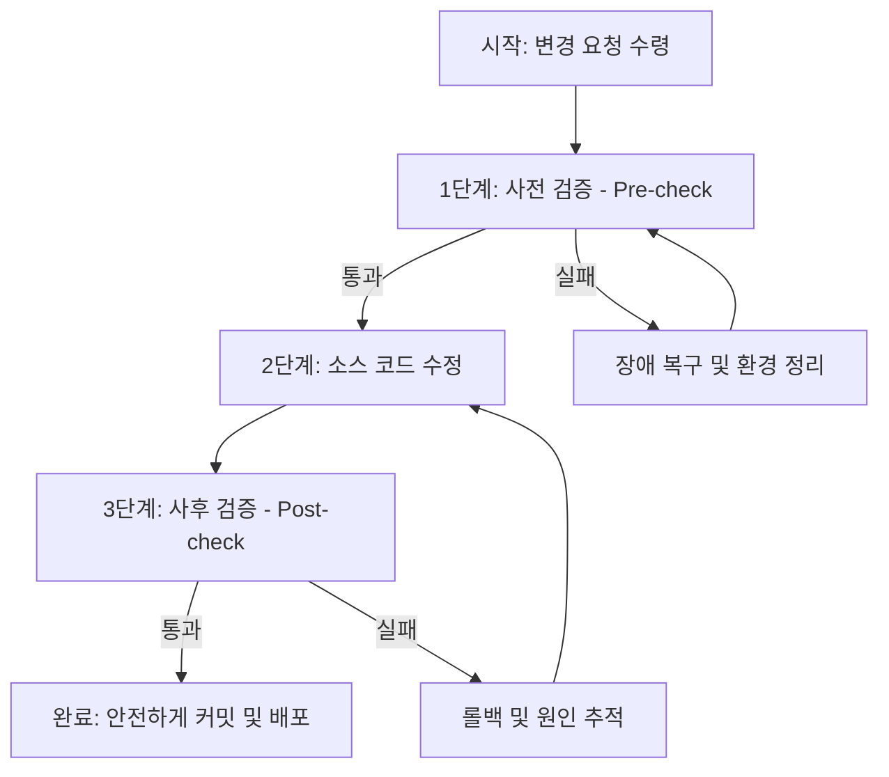

# 🌐 AI 지능형 운영 시스템 통합 개발 및 리그레션 방지 스킬 지침 (skill.md)

이 지침은 **AI 개발 에이전트(Antigravity 등)** 및 **시스템 개발자**가 본 시스템(Situation Room & Backend)의 기능을 확장, 리팩토링 또는 버그 수정을 할 때, 4대 핵심 아키텍처의 정합성을 보장하고 시스템 무결성을 안전하게 유지하기 위한 **통합 개발 스킬 규약**입니다.

이 가이드를 준수하여 코드를 변경함으로써, 기능 수정('A')이 매장 설정('B') 및 E2E 시나리오('C')에 부작용(리그레션)을 초래하는 것을 사전에 차단하십시오.

---

## 🏛️ 1. 4대 핵심 아키텍처 개발 규칙

코드를 변경할 때 아래의 4대 아키텍처 원칙을 엄격하게 준수해야 합니다.

### ① CodeLess 논리 매트릭스 (Logic Matrix)
* **설정 중심 설계**: 새로운 운영 규칙이나 비즈니스 분기를 추가할 때 코드를 하드코딩하지 마십시오. 매장 설정 파일(`master_config_v2_그레이스_하이테크_커피.json`) 및 DB 템플릿과 연동되도록 유연하게 설계해야 합니다.
* **상태 제어 연동**: 주방 완료, 서비스 완료, 정산 완료 등 상태 머신의 전이는 분기 조건에 따라 동적으로 구성되어야 합니다.

### ② AI Knowledge Pool (중앙 지식 저장소)
* **타입 무결성**: 모든 지식 데이터는 `Bundle` 구조(`types.ts`)를 엄격하게 따릅니다. 12가지 주요 타입(Orders, Menus, Waiting, Checkins, Reservations, Settlement 등)의 스키마 변경 시, 백엔드와 프론트엔드가 상호 참조하는 타입 정의를 동시 동기화해야 합니다.
* **MQTT 실시간 스트리밍**: 상태가 갱신되면 반드시 `store/{store_id}/kitchen` 등의 적절한 MQTT 토픽으로 발행(Publish)하여 프론트엔드와 실시간 동기화를 유지해야 합니다.
* **자연어 해석 정합성**: `/api/situation`을 통해 자연어를 번들로 변환하는 AI 해석 메커니즘을 수정할 때는 기존 JSON 스키마의 필수 필드가 누락되지 않도록 해야 합니다.

### ③ 객체 수명 주기 관리 (Object Lifecycle)
* **엄격한 상태 전이**: 번들의 수명 주기는 `pending` → `cooking` → `ready` → `served` → `paid` → `archived` 단계를 기본으로 합니다. 임의로 커스텀 상태를 정의해 흐름을 단절시키지 마십시오.
* **아카이빙(Archiving) 원칙**: 완료된 상태의 데이터는 절대 데이터베이스에서 물리 삭제(`DELETE`)하지 않고, `status = 'archived'` 상태로 변경하여 DB에 보존하는 소프트 삭제(Soft Delete) 아카이빙 규칙을 적용하십시오. (단, 소모성 호출 데이터인 `table_calls` 등은 정책에 따라 물리 삭제 허용)

### ④ 대화형 UX & 마이크로 UI
* **독립성 유지**: 13개 이상의 마이크로 UI(KitchenDisplay, CounterPad, CallManager 등)는 각각 독립적으로 동작하면서도 실시간 동기화 상태를 유지해야 합니다.
* **일관된 로깅**: 디버그 및 모니터링을 위해 모든 핵심 비즈니스 이벤트는 `DebugPanel.tsx`에서 모니터링할 수 있도록 표준 색상 코드(`error`, `success`, `warn`, `info`) 및 타임스탬프가 적용된 로그 포맷으로 전달되어야 합니다.

---

## 🏃 2. 개발 및 무결성 검증 워크플로우

어떤 변경 작업이든 코드 수정 전후로 아래 **3단계 무결성 검증 체인**을 반드시 가동하십시오.



### 1단계: 사전 검증 (Pre-check)
수정을 시작하기 전, 현재 로컬 시스템의 상태가 정상인지 **자동화 테스트 하네스**를 가동하여 선제적으로 검증합니다.
```powershell
python scripts/verify_regression.py
```
* **주의**: 만약 이 단계에서 이미 실패(FAIL)가 뜬다면, 변경 전 상황에 환경적 결함이나 구 버전 서버 캐시 오류가 있는 것이므로 `run.bat` 재실행 및 환경 정리를 먼저 수행하십시오.

### 2단계: 코드 수정
최소 범위의 변경 방식으로 대상 소스 코드('A')를 신중히 수정합니다. 
* 기존 타입 시그니처나 백엔드 REST API의 반환 구조를 함부로 변경해 클라이언트 통신을 마비시키지 않도록 주의합니다.

### 3단계: 하네스를 통한 사후 검증 (Post-check)
수정이 끝난 직후, 즉시 테스트 하네스를 재가동하여 리그레션 여부를 최종 검증합니다.
```powershell
python scripts/verify_regression.py
```
* **🎉 성공**: 콘솔에 `[SUCCESS] 리그레션 없음!`이 표시되면, 수정사항이 B와 C 컴포넌트에 사이드 이펙트를 주지 않았음이 검증된 것이므로 안전하게 커밋하거나 머지합니다.
* **🚨 실패**: `[FAIL] E2E 테스트 시나리오 실패 검출`이 나타나면, 방금 수정한 코드가 시스템 흐름을 파괴했음을 의미하므로 즉시 수정 코드를 롤백하거나 에러 추적 단계를 밟습니다.

---

## 🚨 3. 트러블슈팅 및 예외 대응

하네스 검증 실패 또는 서버 오작동 시 아래 단계별로 복구를 진행하십시오.

1. **로컬 API 서버 통신 실패 (`http://localhost:8000` 연결 불능)**
   * 원인: `run.bat` 또는 `start_system.bat` 콘솔 창이 예기치 않게 닫혔거나 에러로 인해 중단됨.
   * 해결: 백엔드 포트(8000)를 사용 중인 프로세스가 있다면 정리하고, `run.bat`을 재실행하여 백엔드 온라인 상태를 확인합니다.

2. **JSON 파싱 및 스키마 무결성 에러**
   * 원인: `master_config_v2_그레이스_하이테크_커피.json` 수정 중 콤마 누락 등의 문법 오류가 발생했거나 필수 키가 변경됨.
   * 해결: 하네스가 가리키는 오류 라인을 검토하고, JSON Validator를 이용해 형식을 수정합니다.

3. **E2E 테스트 시나리오 실패 (`test_e2e.py` 실패)**
   * 원인: 수정한 비즈니스 API 로직이 예외를 던지거나 클라이언트가 기대하는 상태 전이를 지연시킴.
   * 해결: 하네스 콘솔에 출력된 `E2E 테스트 출력` 로그 및 `test_e2e.py`에 명시된 시나리오 단계를 대조하며 실패 원인이 된 엔드포인트를 디버깅합니다.

---

## 🤖 4. AI 에이전트 행동 강령

1. **항상 `skill.md` 우선 로드**: 새로운 작업 제안을 받았거나 변경 작업을 착수하기 전, 본 `skill.md` 파일을 리드하여 정해진 규칙을 인지하십시오.
2. **함부로 삭제(DELETE) 지양**: DB나 데이터 구조 삭제 관련 태스크 수행 시, 아키텍처 규칙 ③번에 위배되는지 확인하고 불가피한 경우 사용자에게 안전성을 사전 설명하십시오.
3. **독립성 유지**: 마이크로 UI를 생성하거나 수정할 때, 다른 마이크로 UI의 동작 영역을 침범하지 않도록 모듈화된 설계를 고수하십시오.
